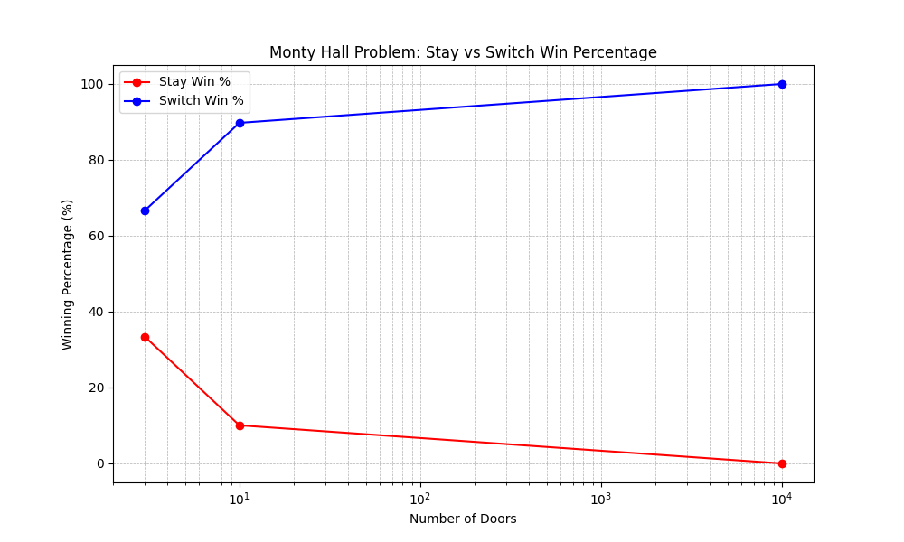

# The Monty Hall Problem

The Monty Hall Problem is a brain teaser, in the form of a probability puzzle, based nominally on the American television game show ***Let's Make a Deal*** and named after its orginal host, ***Monty Hall***. This Python project simulates the game show and highlights the statistical concept behind it, allowing for better understanding to this classical problem. The code is inspired by 50 Examples for Teaching Python so be sure to check them out.

## Table of Contents

- [Introduction](#introduction)
- [Play the Game](#play-the-game)
- [Savant in Parade](#savant-in-parade)
- [Standard Assumptions](#standard-assumptions)
- [Features](#features)
- [Installation](#installation)
- [Usage](#usgae)
- [License](#license)

## Introduction

The Monty Hall Problem is a counter-intuitive statistics puzzle. This simulation puts to the test the "switch" strategy vs the "stay" strategy, statistically verifying which yields a better chance of winning. By running simulations across a variety of door scenarios (3, 10, and 1,000 doors), the project showcases a clear result: **switching** is the optimal choice.

## Play the Game

The car is hidden in one of three doors.

The host will ask the contestant to choose one of those three doors. For demonstration purposes, let's say the contestant picked door 1.

The host knowing the contents behind each door, opens one of the remaining doors, let's say door 3 which reveals a goat.

The host will then ask the contestant whether he/she wants to switch or stay.

What should the contestant do?

## Savant in Parade

The solution presented by ***Savant in Parade*** shows the three possible arrangement of one car and two goats behind three doors and the result of staying or switching after initially picking door 1 in each case.

| Behind door 1 | Behind door 2 | Behind door 3 | Results if staying at door #1 | Results if switching to the door offered |
| --- | --- | --- | --- | --- |
| Goat | Goat | Car | Lose | `Win` |
| Goat | Car | Goat | Lose | `Win` |
| Car | Goat | Goat | `Win` | Lose |

A player who stays with the initial choice wins in only one out of three of these equally likely possibilities, while a player who switches wins in two out of three.

## What IF 100 Doors?

- There are 100 doors to pick from in the beginning
- You pick one door
- Monty looks at the 99 others, finds the goats, and opens all but 1

Do you stick with your original door (1/100), or the other door, which was filtered from 99?

It’s a bit clearer: Monty is taking a set of 99 choices and improving them by removing 98 goats. When he’s done, he has the top door out of 99 for you to pick.

Your decision: Do you want a random door out of 100 (initial guess) or the best door out of 99? Said another way, do you want 1 random chance or the best of 99 random chances?

We’re starting to see why Monty’s actions help us. He’s letting us choose between a generic, random choice and a curated, filtered choice. Filtered is better.

**Sourced from:** [Understanding the Monty Hall Problem - BetterExplained](https://betterexplained.com/articles/understanding-the-monty-hall-problem/)

## Overcoming Our Misconceptions

Assuming that “two choices means 50-50 chances” is our biggest hurdle.

Yes, two choices are equally likely when you know nothing about either choice. If I picked two random Japanese pitchers and asked “Who is ranked higher?” you’d have no guess. You pick the name that sounds cooler, and 50-50 is the best you can do. You know nothing about the situation.

Now, let’s say Pitcher A is a rookie, never been tested, and Pitcher B won the “Most Valuable Player” award the last 10 years in a row. Would this change your guess? Sure thing: you’ll pick Pitcher B (with near-certainty). Your uninformed friend would still call it a 50-50 situation.

Information matters.

**Sourced from:** [Understanding the Monty Hall Problem - BetterExplained](https://betterexplained.com/articles/understanding-the-monty-hall-problem/)

## Standard Assumptions

1. The host must always open a door that was not selected by the contestant.
2. The host must always open a door to reveal a goat and never the car.
3. The host must always offer the chance to switch between the door chosen originally and the closed door remaining.

When any of these assumptions are varied, it can change the probability of winning by switching doors. It is also typically presumed that the car is initially hidden randomly behind the doors and that, if the player initially chooses the car, then the host's choice of which goat-hiding door to open is random. The player's initial choice is considered to be random as well.

## Features

- Simulates The Monty Hall Problem for different scenarios (3, 10, and 10,000 doors).
- Dynamic print statements to simulate the game show.
- Conducts a default of 10,000 trials for each scenario and strategy.
- Compares win percentage for both "staying" and "switching" strategies.
- Provides clear visualizations using tables and graph to highlight the advantage of switching.

## Installation

1. Clone the repository:

```powershell
git clone https://github.com/klaus-001/monty-hall-problem.git
```

2. Install dependencies:

```powershell
pip install pandas matplotlib
```

## Usage
Navigate to the directory containing the repository. To run the program, execute the following command in your terminal:

```powershell
python main.py
```

## Results Visualization 

The plot below illustrates the winning percentages for both "Stay" and "Switch" strategies across different numbers of doors. As shown, the "Switch" strategy consistently yields a higher winning percentage, confirming it as the optimal approach.



| num_doors | stay_wins | switch_wins | stay_win_percentage | switch_win_percentage |
| --- | --- | --- | --- | --- |
| 3 | 3333 | 6659 | 33.33 | 66.59 |
| 10 | 971 | 8989 | 9.71.33 | 89.89 |
| 1000 | 18 | 9992 | 0.18 | 99.92 |

## License

This project is not licensed.